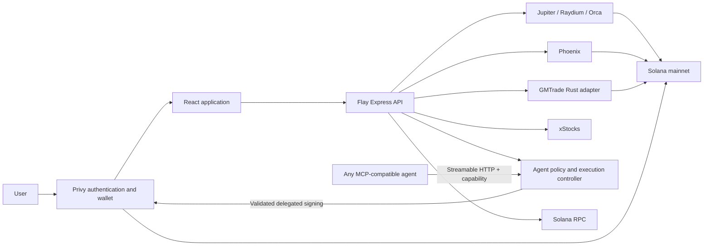

# Flay

Flay is a self-custodial Solana trading application that combines a familiar exchange experience with onchain execution. Users sign in with email or Google, receive an exportable Privy embedded wallet, and access aggregated swaps, limit orders, perpetual futures, tokenized stocks, fiat funding, and eligible gasless transactions from one interface.

**Live application:** [flay-production.up.railway.app](https://flay-production.up.railway.app)

Flay is a public beta running on Solana mainnet. It does not custody user assets, operate a trading venue, deploy a custom Solana program, or charge an application fee.

## Features

| Product | Implementation |
| --- | --- |
| Authentication and wallet | Privy email/Google authentication, embedded Solana wallet, wallet export, deposits, balances, and user-controlled signing |
| Convert | Exact-input market quotes from Jupiter Swap V2, Raydium Trade API, and Orca Whirlpools with automatic or manual route selection |
| Limit orders | Jupiter Trigger orders with explicit review and wallet signing |
| Futures | Unified Phoenix and GMTrade markets, route comparison, reference candles, collateral controls, order review, positions, and recovery states |
| Stocks | Official xStocks Solana catalog, Token-2022 scaled-share accounting, issuer reference data, and Jupiter execution |
| Funds | Privy Card Onramps, wallet receive address, and a bounded USDC transfer flow |
| AI agent access | Framework-neutral MCP and REST access with wallet-bound capabilities, product allowlists, USD/slippage/leverage limits, and owner-selected `Always ask` or delegated automatic execution |
| Gas sponsorship | Jupiter-managed sponsorship for eligible Jupiter swaps and Privy-managed sponsorship for eligible reviewed SPL swaps and USDC sends |
| Activity | Wallet-bound transaction history and links to confirmed Solana transactions |

Provider eligibility is checked for every action. A route can be unavailable because of liquidity, venue onboarding, wallet balance, account rent, regional restrictions, or provider health.

## How Flay works



The server requests quotes, normalizes venue responses, builds transactions, validates their structure, and simulates the exact transaction where required. In `Always ask`, the browser presents the provider, output, minimum received, fees, sponsorship status, and warnings before the user signs. In automatic mode, the user grants Privy wallet delegation once and Flay signs only the exact validated transactions allowed by that capability's guardrails.

Futures candles are stable reference data rendered with TradingView Lightweight Charts. They are not presented as a venue's exact execution price. Phoenix and GMTrade retain their own collateral, funding, liquidation, and position models.

## Trust and security model

- Flay never receives or stores an embedded-wallet private key.
- State-changing API requests are authenticated and bound to the authenticated wallet.
- Quotes and prepared transactions expire; stale transactions must be rebuilt.
- Provider-built transactions are checked against the reviewed wallet, mints, amounts, programs, pools, and fee payer before signing.
- Exact simulations enforce current balance, network-fee, and account-rent requirements.
- Sponsored flows accept only their reviewed transaction shape and verify the confirmed onchain result.
- Provider secrets, identity tokens, signed transaction bytes, and private RPC credentials stay out of browser bundles and logs.
- A provider outage disables affected new actions while preserving visible balances, positions, and recovery controls where cached state is available.
- AI agent credentials are stored as SHA-256 hashes, expire automatically, and accept only bounded structured trading intents. The approval mode is immutable per credential. Agents never receive Privy signing access, wallet IDs, transaction bytes, identity tokens, fiat funding, wallet export, transfers, or arbitrary program calls.

MagicBlock protected-balance functionality is isolated from third-party venues. It does not make Jupiter, Phoenix, GMTrade, or xStocks activity private; those transactions remain observable on Solana.

## AI agent access

The **Agent access** workspace lets a signed-in user create a narrow capability for an external AI agent. The policy selects Convert, xStocks, and/or Futures, then limits tokens or markets, value per request, rolling 24-hour value, slippage, leverage, open positions, and credential lifetime.

Each capability has one immutable approval mode:

- **Always ask:** Flay validates the intent and places it in the wallet's approval queue. The user opens the exact provider transaction, reviews its route and economic terms, and approves it with Privy. Ignored requests expire after 15 minutes.
- **Automatic within guardrails (shown as Full access):** the user first approves Privy's one-time wallet delegation. Flay then resolves the route, validates and simulates the exact transaction, rechecks the capability, asks Privy's server wallet API to sign it, submits it through the existing provider path, and verifies the result. The user does not need to keep Flay open or approve each action.

Automatic mode means full access only to the selected Convert, xStocks, and Futures actions within the configured token/market allowlists, per-request value, rolling daily value, slippage, leverage, open-position, expiry, and request-rate limits. It does not authorize fiat onramp, wallet send, key export, message signing, MagicBlock, arbitrary transactions, arbitrary programs, or policy changes. The owner can revoke an individual capability or revoke all automatic wallet access from the Agent workspace.

Revocation blocks new and retrying actions immediately. A transaction already submitted to Solana cannot be recalled; Privy's sponsored signing and broadcast is one atomic provider operation, so revocation cannot interrupt that operation after it has begun.

```sh
export FLAY_AGENT_CREDENTIAL='copy-the-one-time-value-from-flay'

curl -X POST https://flay-production.up.railway.app/api/agent/requests \
  -H "Authorization: Bearer $FLAY_AGENT_CREDENTIAL" \
  -H 'Content-Type: application/json' \
  --data '{
    "idempotencyKey": "811ad33d-c22f-41f9-8bcd-bbb8b9a84551",
    "intent": {
      "kind": "convert",
      "inputMint": "EPjFWdd5AufqSSqeM2qN1xzybapC8G4wEGGkZwyTDt1v",
      "outputMint": "So11111111111111111111111111111111111111112",
      "amountAtomic": "1000000",
      "slippageBps": 50
    }
  }'
```

Supported intent kinds are `convert`, `stock`, `futures-open`, and `futures-manage`. Fiat onramp, wallet send, private-key export, MagicBlock, policy changes, signing, and arbitrary Solana instructions are absent from the capability API. Capability and approval records are bounded in-process data in the current single-replica deployment, so deployments invalidate outstanding credentials and requests. Reissue a capability after a restart.

### Model Context Protocol

Flay exposes a framework-neutral MCP server at:

```text
https://flay-production.up.railway.app/api/mcp
```

The transport is Streamable HTTP. Every protocol request, including initialization and tool discovery, requires `Authorization: Bearer <capability>`. Keep the one-time capability in the client's secret store or process environment; never put it in an agent prompt or commit it to configuration. The server is stateless per request, returns JSON responses, limits request bodies and request rates, validates same-origin browser calls, and rechecks expiry or revocation before every operation.

This example uses the official TypeScript MCP client, but the endpoint works with any conforming client:

```ts
import { Client, StreamableHTTPClientTransport } from '@modelcontextprotocol/client';

const credential = process.env.FLAY_AGENT_CREDENTIAL;
if (!credential) throw new Error('FLAY_AGENT_CREDENTIAL is required');

const client = new Client({ name: 'my-trading-agent', version: '1.0.0' });
const transport = new StreamableHTTPClientTransport(
  new URL('https://flay-production.up.railway.app/api/mcp'),
  { authProvider: { token: async () => credential } },
);

await client.connect(transport);
const { tools } = await client.listTools();
console.log(tools.map(({ name }) => name));
```

The MCP catalog is intentionally small:

| Tool | Authority |
| --- | --- |
| `flay_get_tokens` | Read bounded public Solana token metadata |
| `flay_get_stocks` | Read a bounded page of the public xStocks catalog |
| `flay_get_futures_markets` | Read normalized public Phoenix and GMTrade market data |
| `flay_request_convert` | Submit a policy-checked Convert intent under the credential's approval mode |
| `flay_request_stock_trade` | Submit a policy-checked xStocks intent under the credential's approval mode |
| `flay_request_futures_open` | Submit a policy-checked Futures open intent under the credential's approval mode |
| `flay_request_futures_manage` | Submit a policy-checked Futures close or cancel intent under the credential's approval mode |

Trading tools require a UUID idempotency key. For `Always ask`, they return the queued request and state that human approval is required. For automatic capabilities, the same call returns the completed or retryable execution state and transaction evidence; concurrent retries with the same key are coalesced and cannot sign or submit twice. There are no MCP tools for fiat funding, wallet sends, raw signing, arbitrary transaction submission, key export, policy mutation, or arbitrary program instructions.

## Technology

- **Frontend:** React 19, TypeScript, Vite, Lightweight Charts
- **API:** Express 5, Zod, Solana Web3.js
- **Authentication and wallet:** Privy
- **Swap venues:** Jupiter, Raydium, Orca
- **Futures venues:** Phoenix and GMTrade
- **Tokenized stocks:** xStocks with Jupiter execution
- **Protected balance integration:** MagicBlock
- **Agent controls:** Official MCP Streamable HTTP server and REST capability API with deterministic Zod contracts
- **GMTrade bridge:** pinned Rust sidecar using `gmsol-sdk`
- **Deployment:** Docker and Railway

## Repository structure

```text
.
├── apps/web/                    React client, Express API, shared types and tests
├── services/gmtrade-adapter/    Non-signing Rust adapter for GMTrade
├── .railway/railway.ts          Railway infrastructure configuration
├── Dockerfile                   Production multi-stage build
├── AGENTS.md                    Repository engineering and safety rules
└── agent.md                     Implementation-plan and completion-audit record
```

## Local development

### Prerequisites

- Node.js 22 or newer
- npm 10 or newer
- Rust 1.90 or newer
- A Solana mainnet RPC that supports token-account reads, address lookup tables, transaction history, and v0 transaction simulation
- A Privy application configured for Solana embedded wallets

### Setup

```sh
git clone https://github.com/ahumdigar/flay.git
cd flay

cargo build --release --locked \
  --manifest-path services/gmtrade-adapter/Cargo.toml

cd apps/web
npm ci
cp .env.example .env
npm run dev
```

Open [http://localhost:5173](http://localhost:5173).

The server automatically serves the Vite application in development and the built `dist` directory in production. Use `npm run dev:supervised` when a local process should restart after an unexpected provider-level failure.

## Configuration

Copy [`apps/web/.env.example`](apps/web/.env.example) to `apps/web/.env`. The real `.env` is ignored by Git.

| Variable | Required | Purpose |
| --- | --- | --- |
| `VITE_PRIVY_APP_ID` | Yes | Public Privy application identifier used by the browser |
| `PRIVY_APP_ID` | Yes | Matching server-side Privy application identifier |
| `PRIVY_VERIFICATION_KEY` | Yes | Server-only Privy identity-token verification key |
| `PRIVY_APP_SECRET` | Automatic agents only | Server-only Privy application secret used to resolve delegated wallets |
| `PRIVY_AUTHORIZATION_PRIVATE_KEY` | Automatic agents only | Base64 PKCS8 P-256 private authorization key; never use a wallet private key or a `VITE_` variable |
| `SOLANA_RPC_URL` | Yes | Primary Solana mainnet RPC |
| `SOLANA_FALLBACK_RPC_URL` | No | Optional independent RPC fallback |
| `VITE_PRIVY_ONRAMP_ENV` | Yes for funding | `sandbox` or `production`; embedded into the client build |
| `JUPITER_API_KEY` | No | Higher-capacity Jupiter API access when available |
| `GMTRADE_ADAPTER_BIN` | No | Override for the compiled GMTrade adapter path |
| `GMTRADE_ADAPTER_TIMEOUT_MS` | No | Bounded sidecar request timeout |
| `MAGICBLOCK_BASE_URL` / `MAGICBLOCK_TEE_BASE_URL` | No | MagicBlock service endpoints |
| `XSTOCKS_*` | No | Official xStocks endpoint and cache/timeout tuning |
| `PROVIDER_TIMEOUT_MS` / `QUOTE_CACHE_MS` | No | Global provider and quote-cache tuning |

Never place a secret, private RPC URL, or server verification material in a `VITE_` variable. Vite variables are public browser configuration.

In the Privy dashboard:

1. Add the local and deployed origins.
2. Enable email and/or Google login.
3. Enable embedded Solana wallets, user-owned wallet export, and identity tokens.
4. Enable Card Onramps for production funding.
5. Configure Solana mainnet fee sponsorship and billing before testing Privy-sponsored actions.
6. To enable automatic agents, enable server-side wallet access/delegated actions, require signed wallet API requests, register the matching P-256 authorization public key, and set the app secret plus authorization private key only in the server environment.

Gas sponsorship is dynamic. Flay labels an action sponsored only after validating the exact prepared transaction and its non-user fee payer. Native SOL wrapping, missing token accounts, venue setup rent, limit orders, and futures actions can still require wallet SOL.

## Commands

Run these commands from `apps/web`:

| Command | Purpose |
| --- | --- |
| `npm run dev` | Start the development server |
| `npm run dev:supervised` | Start the self-restarting local supervisor |
| `npm run build` | Run TypeScript checks and create the production Vite bundle |
| `npm run test` | Run the Vitest suite |
| `npm run check` | Run the production build and full test suite |
| `npm run release:audit` | Scan source and browser bundles for release-safety violations |
| `npm run browser:audit` | Exercise desktop and mobile product flows through Chromium CDP |
| `npm run browser:audit:onramp` | Exercise the isolated Privy onramp checkout flow |

The live-provider tests are intentionally gated and may be skipped when their required credentials or mainnet conditions are unavailable. Unit and integration tests must not submit real transactions.

## Dependency advisory status

The pinned GMTrade SDK currently brings six Rust advisories through its Solana 2.1 dependency graph: `RUSTSEC-2024-0344`, `RUSTSEC-2022-0093`, `RUSTSEC-2026-0258`, `RUSTSEC-2026-0098`, `RUSTSEC-2026-0099`, and `RUSTSEC-2026-0104`. They are explicit exceptions in `services/gmtrade-adapter/.cargo/audit.toml`. The adapter is a bounded, non-signing stdin/stdout sidecar that receives public keys and returns unsigned transaction data; it never holds a user key. These exceptions must be removed after GMTrade publishes a compatible SDK on a fixed Solana dependency generation.

The JavaScript production tree currently has three low-severity `elliptic` findings inherited through the MagicBlock attestation dependency. There are no accepted moderate, high, or critical npm findings. Do not force a breaking dependency downgrade to hide these results; re-evaluate them when MagicBlock publishes a compatible fixed tree.

`apps/web/vendor/bigint-buffer` is a private pure-JavaScript compatibility package replacing the unpatched native `bigint-buffer@1.1.5` binding. It exposes only the four bounded conversion functions required by the Solana dependency tree and has no native code or install script.

## Production deployment

The root [`Dockerfile`](Dockerfile) builds the locked Rust GMTrade adapter and the React application, then creates a non-root Node 22 runtime. Railway configuration in [`.railway/railway.ts`](.railway/railway.ts) keeps one replica because prepared transaction intents are short-lived in-memory records.

With the Railway CLI authenticated and the project linked:

```sh
npm ci
railway config apply --yes
railway up --detach --service flay --environment production
```

Set production variables in Railway rather than committing them. Railway supplies `PORT`; Flay binds to `0.0.0.0`. After deployment, verify:

```sh
curl -fsS https://flay-production.up.railway.app/api/health
```

The health response reports sanitized readiness for Privy, RPC, swap providers, Futures, Stocks, MagicBlock, and funding integrations without exposing credentials.

## Product boundaries

- Flay currently targets Solana mainnet only.
- Users choose explicit per-action approval or one-time delegated authorization for bounded Agent execution; confirmation and settlement still depend on Solana and the selected venue.
- AI agents can submit only policy-approved trading intents. `Always ask` requires a human Privy signature for every value-changing action; automatic mode requires one-time wallet delegation and then signs only Flay-validated transactions within the owner's guardrails.
- Phoenix execution requires wallet onboarding and collateral setup before it becomes eligible.
- GMTrade availability depends on the pinned sidecar and upstream GMTrade services.
- xStocks are tokenized financial instruments, not direct equities. Availability and rights depend on the issuer and the user's jurisdiction.
- Fiat purchases are completed by Privy's available payment provider and are subject to regional support, KYC, provider fees, and provider terms.
- Low-value trades may be uneconomic or impossible when network fees, token-account rent, venue minimums, or available liquidity exceed the wallet's usable balance.
- Protected-balance integrations do not conceal public third-party trades or wallet funding on Solana.

Flay is experimental software. Review each capability's limits and every manually approved transaction, venue, fee, and risk disclosure before authorizing activity.
