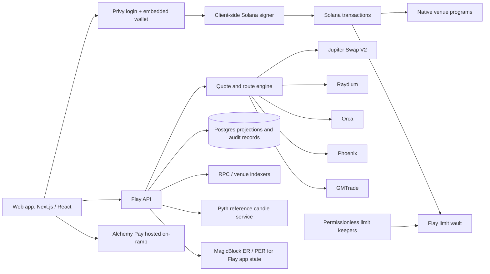

# Flay technical design

**Status:** long-term production target  
**Date:** 2026-09-14  
**Network:** Solana mainnet-beta for production; local validator and supported test environments for development

> **Active hackathon scope:** [Flay Convert: real hackathon release](HACKATHON_CONVERT_PLAN.md) supersedes the custom Flay limit-vault deployment for the budget-constrained hackathon build. This document retains the funded production architecture and post-hackathon upgrade path.

## 1. Product boundary

Flay is a self-custodial Solana trading interface and execution aggregator. It is not an exchange venue or a pooled custodial account. A user signs in with a social account through Privy, receives an embedded Solana wallet, and can export that wallet's private key through Privy's client-side export flow. Flay's servers never receive or store the key. The connected wallet owns the user's on-chain assets; a venue may require a separate, user-controlled trading account or collateral deposit.

The initial trading products are:

| Product | User experience | Execution |
| --- | --- | --- |
| Convert / Market | Enter token pair and amount; see one best route with alternatives and a minimum received amount | Compare Jupiter Swap V2, direct Raydium, and direct Orca executable quotes |
| Convert / Limit | Specify input amount, minimum output, and expiry; see open, filled, canceled, or expired status | Flay-owned, audited order-vault program plus permissionless keepers; only routes proven safe for program-controlled escrow |
| Futures / Market and Limit | One consistent market page and reference candle chart; automatic route recommendation with manual Phoenix or GMTrade choice | Native Phoenix or GMTrade position and order instructions; no Flay perpetual venue |
| Deposit | Show wallet address for on-chain deposits; offer hosted fiat on-ramp | Solana transfer or Alchemy Pay purchase into the user's wallet |
| Modes | Normal and Private activity modes | MagicBlock ER for Flay-controlled app state in Normal; PER for the same state in Private, subject to a privacy proof of concept |

Memecoin discovery/trading and xStocks are later phases. No extra Flay trading fee is charged in beta; venue, network, collateral, and on-ramp fees remain visible. A later fee requires an explicit product decision and new quote accounting.

## 2. System architecture



Use a TypeScript web app and API, a Postgres database, and a separate worker for transaction reconciliation and limit-keeper jobs. The API builds or relays *unsigned* transaction instructions and quote metadata; only the user's Privy wallet signs user transactions. The worker may sign its own keeper transaction, but has no authority to transfer from a user's wallet or redirect vault proceeds. Postgres is a search and history projection. Solana and the venues remain the source of truth for balances, order execution, and positions. Use a paid Solana RPC with a fallback endpoint, websocket subscriptions for fast updates, and periodic polling to repair missed events.

The API verifies Privy authentication and binds the authenticated identity to the wallet public key. Trade authorization still comes from a wallet signature. Do not treat a browser-supplied wallet address, price, account balance, or order status as authoritative. Keep API keys for Jupiter, Alchemy Pay, Pyth, and venue partners server-side where their integration allows it.

Suggested repository layout:

```text
apps/web/                 React UI, Privy wallet, transaction approval
apps/api/                 sessions, quotes, prepared transactions, portfolio
apps/worker/              chain reconciliation, limit keepers, alerts
packages/domain/          amount math, normalized quotes, route policy
packages/adapters/        Jupiter, Raydium, Orca, Phoenix, GMTrade
programs/limit-vault/     Solana escrow program and tests
programs/activity-state/  Flay-only accounts delegated to MagicBlock ER/PER
```

## 3. Wallet, deposits, and balances

1. Privy authenticates the user and creates or connects a Solana embedded wallet. The UI shows the public address, network, signing prompts, and a wallet-export entry point. Export runs only in the supported secure client flow; Flay never proxies or logs the secret. [Privy wallet export](https://docs.privy.io/wallets/wallets/export).
2. On-chain deposits go to the user's wallet address. Show mint, chain, deposit address, required network fee reserve, and confirmation status. On-chain arrival, not a user-entered amount, updates the available balance.
3. Fiat uses Alchemy Pay's hosted page first. Pass the destination Solana wallet and supported asset/network parameters. On return, show `pending` until provider status is verified where available *and* the expected on-chain funds are observed. Handle underpayment, different assets, delays, refunds, and unsupported jurisdictions as separate states. [Alchemy Pay integration options](https://alchemypay.readme.io/docs/integration-options), [page integration](https://alchemypay.readme.io/docs/page-integration-2).
4. Futures collateral is not part of the wallet spendable balance after deposit. Phoenix uses a separate USDC trader account, with account activation and funding before orders. GMTrade selects a collateral token and pool per position. The UI shows `wallet`, `Phoenix`, and `GMTrade` funds separately and requests an explicit signature for each required transfer. [Phoenix collateral](https://docs.phoenix.trade/sdk/collateral), [GMTrade trading](https://docs.gmtrade.xyz/about/trading/).

Balances are indexed by `(wallet, chain, token_mint, location)`. Use integer atomic units and mint decimals for display. Never use JavaScript floating-point numbers to construct transaction amounts, prices, min-output checks, or PnL calculations.

## 4. Convert / Market routing

The quote service accepts an exact-input pair, input amount, user wallet, and slippage ceiling. It requests Jupiter Swap V2 Meta-Aggregator, direct Raydium pool routes, and direct Orca Whirlpool routes in parallel. The direct adapters use the respective pool SDKs and identify the actual pool/program IDs; they do not merely repackage Jupiter or another cross-venue aggregator response. Raydium and Orca are independent *execution candidates* even when Jupiter internally sees the same pools. Do not label that overlapping liquidity as additional independent market depth. A candidate qualifies only if its token programs, fees, account requirements, transaction size, expiry, and wallet signing path are supported. [Jupiter Swap V2 paths](https://developers.jup.ag/docs/swap), [Raydium pool integration](https://docs.raydium.io/integration-guides/aggregator), [Orca swap SDK](https://docs.orca.so/developers/sdks/trade).

Normalize each provider response to:

```text
route_id, provider, input_mint, output_mint, input_atomic,
expected_output_atomic, minimum_output_atomic,
fee_items[{mint, atomic, included_in_output}],
network_fee_lamports, priority_fee_lamports, extra_rent_lamports,
price_impact_bps, quote_created_at, provider_expiry,
build_method, availability_reason
```

Define `expected_output_atomic` as the tokens the wallet is expected to receive **after** swap fees already embedded in the venue quote; do not deduct those fees twice. For the same exact input, rank eligible routes by expected wallet output after only separately charged, nonrecoverable venue and transaction fees, accounting for each fee mint. Convert SOL transaction costs into the output token using a fresh reference price only for ranking, and show the conversion assumption. Show refundable token-account rent separately as upfront SOL required, not as a permanent fee. If cost conversion is unavailable or unreliable, do not claim one route is best; show comparable output and SOL cost separately. Use minimum output as the user's risk bound, not as the predicted fill. Reject stale, non-simulatable, or unsupported quotes. Break near-ties by simulation success and execution reliability. No provider is guaranteed to remain best after price movement or quote expiration.

At confirmation, refresh the chosen route and its alternatives. If the winner, minimum received, fees, or required approvals materially changes, show a new review screen. Build *one* chosen transaction, simulate where possible, request one wallet signature, submit, and reconcile the actual token deltas. Never silently submit a different venue after a failed signature or transaction. Jupiter's Meta-Aggregator returns a fully assembled transaction and its managed `/execute` path; its Router `/build` path returns raw Metis instructions for custom transaction composition. These are separate adapters with different capabilities. [Jupiter Swap V2](https://developers.jup.ag/docs/swap).

For beta, support ordinary SPL Token and Token-2022 mints only after the adapter verifies the mint's extensions and required accounts. Unsupported transfer fees, hooks, frozen accounts, or illiquid pools produce a clear unavailable state rather than an optimistic quote. Wrap and unwrap SOL explicitly where a route requires WSOL, and include associated-token-account rent and priority fees in the review.

## 5. Convert / Limit vault

A limit order means: **spend up to a fixed input amount only when an executable route can deliver at least the specified output amount before expiry**. A displayed market mid-price touching the limit is insufficient. The first release has no partial fills. The user signs a placement transaction depositing the exact swap input into a unique program-derived token vault and an explicitly disclosed, capped SOL keeper bounty into a separate fee vault. The fee vault pays the caller only after a valid fill and returns unused SOL on cancel/expiry; the swap input itself cannot be diverted to pay the keeper. The vault stores owner, input/output mints, total swap input, minimum output, expiry slot or timestamp, nonce, maximum keeper bounty, permitted token-program IDs, and status. Placement ensures the owner-controlled output token account exists and records its address; the user funds any account rent. The order cannot be edited; a replacement means cancel and place a new order. The bounty is an execution cost, not a Flay trading fee, and appears in the pre-placement review.

Program instructions:

| Instruction | Required checks and result |
| --- | --- |
| `place_order` | Owner signs; validate mints, amount, minimum output, expiry, token programs, and bounty cap; move exact input and SOL bounty into separate vaults |
| `fill_order` | Any keeper may call; reject stale/canceled/filled orders; invoke an allowlisted, audited route; send proceeds to the recorded owner-controlled token account; atomically verify its final output-token balance increased by at least `minimum_output_atomic`, after any transfers; pay only the capped bounty |
| `cancel_order` | Owner signs; return all remaining input and bounty to owner; mark canceled atomically |
| `expire_order` | Anyone may call after expiry; return all remaining input and bounty to owner; mark expired atomically |

The program must reject arbitrary recipient accounts, writable account substitutions, unknown route program IDs, wrong token mints, repeated fills, and keeper-controlled fee changes. Vault account ownership and PDA signing are program-enforced. Use a multisig and timelock for upgrade authority after audit; publish the program ID and upgrade policy. Simulate with adversarial tokens/accounts and audit before mainnet funds are accepted.

The market and limit route sets are deliberately different until a proof of concept proves otherwise. Raydium documents PDA escrow and CPI integration, and Orca documents CPI swaps; start the limit keeper with direct routes that pass an end-to-end vault test. Jupiter `/order` transactions cannot be modified for vault CPI. Jupiter `/build` yields raw Metis instructions and *might* be usable for a program-controlled vault, but PDA authority, account metas, compute budget, token compatibility, and atomic min-output guarantees must be demonstrated before enabling that adapter. If none of the validated routes can satisfy the limit, the order remains open. [Raydium CPI integration](https://docs.raydium.io/integration-guides/cpi-integration), [Orca CPI example](https://docs.orca.so/developers/examples/cpi), [Jupiter Swap V2](https://developers.jup.ag/docs/swap).

Keeper attempts use an idempotent order nonce and order state. Failed or competing attempts do not consume the input; successful fills are observed from confirmed chain state. Quote expiry, slippage, execution fees, and keeper compensation are reflected in the fill calculation. Keeper availability is an operational dependency, so show order liveness and allow cancellation at any time before fill.

## 6. Futures routing and position lifecycle

Phoenix is integration priority 1; GMTrade is priority 2. Implement a venue adapter interface that reads supported markets, account prerequisites, live executable prices, fees, collateral rules, risk bounds, position state, native orders, and transaction instructions. Phoenix's Rise TypeScript SDK is the first adapter. GMTrade publishes a Rust SDK; prove that it can produce a valid unsigned transaction for Privy's browser wallet to sign before promising the GMTrade order button. A backend or sidecar may build the bytes, but may not hold the user's private key. [Phoenix Rise SDK](https://docs.phoenix.trade/sdk/rise), [GMTrade SDK](https://docs.rs/gmsol-sdk/latest/gmsol_sdk/client/struct.Client.html).

For a *new* position, the user specifies market, side, desired exposure or collateral, leverage, and order type. Quote both eligible venues for the same economic exposure and a comparable collateral basis. The route engine excludes markets that cannot meet the size, leverage, liquidity, collateral, or account constraints. It estimates executable entry price, price impact, opening/closing fees, network fees, and the number/cost of collateral steps. It then recommends the best **estimated entry** for that exact request. Funding, borrowing rates, liquidation mechanics, and risk differ by venue and can change; present them separately, alongside each venue's own liquidation estimate. Do not compress all of this into a falsely precise lifetime-profit score. Users can override the recommendation. [Phoenix order types](https://docs.phoenix.trade/phoenix/matching-engine/order-types), [GMTrade fees](https://docs.gmtrade.xyz/about/trading_fees_and_rebates/).

Before signature, re-read venue state and show the exact venue, account, collateral transfer, order type, acceptable price, slippage/impact bound, fees, estimated liquidation level, and any required activation. If prefunding is necessary, request that transaction separately, then re-quote and request a new approval for the trade. Never route a transaction to another venue silently after the user has approved one. Do not split one position across venues in the initial release.

Once an order is placed, its venue is fixed. A futures limit order is routed when the user places it; it is **not** silently re-routed at its later trigger. Close, reduce, edit, TP/SL, and cancel operate against that native venue and its native order ID. A trade submission can be `submitted` without being `filled`; the UI waits for venue state to confirm a position or fill. Track partial fills and orphaned TP/SL orders; GMTrade warns that trigger orders can survive a manual close, so surface and offer to cancel them explicitly. Conditional orders are venue-native where supported, with trigger and actual execution prices distinguished. [GMTrade trading](https://docs.gmtrade.xyz/about/trading/).

Initial shared market names are display aliases, not universal instrument IDs. Map each alias to distinct Phoenix and GMTrade market identifiers, tick sizes, funding conventions, max leverage, collateral mint, and trading status. A venue outage removes that candidate from *new* order recommendations but must not hide the user's existing positions there.

## 7. Futures candles and market data

Use **TradingView Lightweight Charts** as the renderer, not as the data source. Flay's candle service supplies one stable reference OHLC feed per underlying market (Pyth Pro History where licensed and available). Label the series `Reference price`, its source, candle interval, and latest update time. Switching the recommended venue changes the quote and execution details, not the candle series. Venue-specific mark, oracle, index, and liquidation prices appear in the order card and position detail; they must not be presented as the chart's exact execution price. If a market lacks an approved reference history feed, say so and omit candles for that market. [Lightweight Charts license and attribution](https://github.com/tradingview/lightweight-charts), [Pyth Pro history API](https://docs.pyth.network/price-feeds/pro/api/history).

Cache historical candles server-side by feed ID and interval, then stream the latest reference updates. Keep Pyth credentials off the client. Follow Lightweight Charts attribution requirements in the UI. Candle data is informational only: venue quotes and venue-specific risk engines control execution, margin, and liquidation.

## 8. Normal and Private activity modes

The mode applies only to state Flay controls. Normal mode writes Flay activity/intent metadata through MagicBlock Ephemeral Rollups (ER). Private mode writes eligible metadata through Private Ephemeral Rollups (PER), after a measured access-control and attestation proof of concept. Candidate state includes watchlists, private draft intents, activity preferences, and Flay-only workflow status. Keep the minimum necessary session linkage and encrypt or avoid sensitive server-side logs. [MagicBlock private rollups](https://docs.magicblock.gg/pages/private-ephemeral-rollups-pers/introduction/onchain-privacy).

Mode does **not** hide social-login records from Privy/Flay, wallet funding, public token swaps, vault placement/fill/cancel, Phoenix or GMTrade collateral and positions, or xStocks/memecoin trades. The limit vault is public on Solana, including its token mints and threshold. Private mode must say `Private Flay activity; trades and balances remain public on Solana` at selection and transaction review. Do not delegate the user's wallet, venue accounts, or active limit vault to ER/PER without a separate security and composability proof. If PER fails, do not silently downgrade to Normal; ask the user to switch or retry.

The public launch of the two-mode promise depends on demonstrating what data actually stays private under PER, who can read it, how it settles to Solana, and what an observer can infer. ER/PER is not a privacy layer for arbitrary third-party trading programs.

## 9. API and durable state

The API uses authenticated JSON requests and returns decimal-string amounts plus atomic integer strings. Quote IDs are short-lived and bound to wallet, mints/market, size, and selected venue. Every state-changing request has an idempotency key. Store transaction signatures with unique constraints; chain replays and websocket reconnects must not double-credit history.

| Endpoint | Purpose |
| --- | --- |
| `POST /api/session` | Verify Privy token, bind session to embedded wallet public key |
| `POST /api/convert/quotes` | Return normalized exact-in market candidates and eligibility reasons |
| `POST /api/convert/prepare` | Re-quote and build one chosen unsigned swap transaction |
| `POST /api/limits/prepare` | Build unsigned `place_order`, `cancel_order`, or reclaim instruction |
| `GET /api/limits` | Reconciled order status from the vault program |
| `GET /api/futures/markets` | Common display markets and per-venue capabilities |
| `POST /api/futures/quotes` | Comparable, eligible new-position quotes plus route recommendation |
| `POST /api/futures/prepare` | Build the chosen venue's unsigned collateral/order instruction(s) |
| `GET /api/portfolio` | Wallet balances, venue collateral, positions, orders, and source timestamps |
| `GET /api/chart/candles` | Stable reference candles for supported futures markets |
| `GET /api/deposits` | On-chain deposit history and provider-linked on-ramp state |

Core relational records:

```text
users(id, privy_user_id, created_at)
wallets(user_id, chain, public_key, verified_at)
trade_intents(id, user_id, product, parameters_hash, selected_venue, created_at)
quotes(id, intent_id, provider, normalized_payload, source_time, expires_at)
transactions(signature, user_id, kind, venue, intent_id, chain_status, observed_at)
limit_orders(order_pda, user_id, mints, input_atomic, min_output_atomic, fee_vault, max_keeper_bounty_lamports, expiry, chain_status)
perp_orders(venue, venue_order_id, user_id, market_id, state, source_time)
perp_positions(venue, venue_position_id, user_id, market_id, state, source_time)
deposits(id, user_id, source, provider_reference, mint, atomic_amount, state, signature)
```

Do not store private-mode intent text or keys in general-purpose quote/history tables. Retain only identifiers and keyed, non-reversible integrity tags needed for reconciliation and security, with an explicit retention period. Do not put low-entropy trade details through an ordinary public hash. The indexer must tolerate chain reorgs, delayed finality, venue API drift, and duplicate events. Label data stale when subscriptions stop or polling exceeds its freshness budget.

State machines distinguish user action from chain/venue result:

```text
Swap: draft -> quoted -> awaiting_signature -> submitted -> confirmed -> settled | failed
Limit: draft -> awaiting_signature -> open -> filled | canceled | expired
Futures: draft -> quoted -> funding_required? -> awaiting_signature -> submitted
         -> accepted -> partially_filled | filled | canceled | rejected
```

An expired quote returns to `quoted` after a fresh quote, never automatically to `submitted`. A confirmed Solana transaction does not by itself prove a futures order filled; reconcile the venue order/position state. If the client disappears after submitting, the worker must recover the outcome from signature and venue identifiers.

## 10. Security and operational requirements

- Wallet signatures must display the selected provider, market/pair, amount, recipient, min output or acceptable price, and any collateral transfer. Validate built instructions against the quote and allowlisted program IDs before handing them to Privy.
- Separate user signer, keeper signer, API credentials, and program upgrade authority. Keep all secrets out of client bundles and logs; rotate API/keeper credentials.
- Use min-output/price-bound checks on chain where the venue or Flay program supports them. Quote freshness and simulation are additional safeguards, not substitutes.
- Detect RPC disagreement, stale indexer state, and venue API errors. Disable new trades for an affected route while preserving access to existing venue positions and cancellation paths.
- Monitor quote-to-fill slippage, route failures, stuck limit orders, keeper profitability, orphaned futures triggers, fiat pending times, PER availability, and wallet signing failures.
- Publish clear disclosures: self-custody, venue-specific liquidation/funding risk, on-chain visibility, on-ramp provider terms, and third-party outages. Legal and regional eligibility review gates fiat and tokenized-stock launch.

## 11. Later product phases

**Memes.** Use Birdeye for discovery and token-security indicators, and always key assets by mint address rather than ticker. For trading, integrate the Pump.fun bonding curve before graduation and PumpSwap afterward, plus eligible Meteora/Raydium/Jupiter routes as liquidity appears. A newly launched token may have one executable source, so Flay should show `Only one available route` rather than claim price aggregation. Verify token metadata and extensions, show liquidity and holder/concentration warnings, and do not imply that a security score is a guarantee. [Pump.fun public docs](https://github.com/pump-fun/pump-public-docs), [Birdeye new listings](https://docs.birdeye.so/reference/new-token-listing), [Birdeye token security](https://docs.birdeye.so/reference/get-defi-token_security).

**xStocks.** Use issuer-published canonical Solana mint metadata and eligible Jupiter/direct Raydium liquidity. xChange RFQ is an optional route only after partner API access, registered-wallet requirements, and jurisdiction checks are satisfied. Account for Token-2022 Scaled UI Amount multipliers: raw token units and displayed economic shares differ, and corporate actions can change the multiplier. Disable quoting around unsupported corporate-action or market-halt states. Label xStocks as tokenized tracker certificates with issuer/market risks, not direct shares with voting rights. Gate display and trading by the issuer's current geographic eligibility and legal review. [xStocks developer docs](https://docs.xstocks.fi/developers), [multipliers](https://docs.xstocks.fi/developers/multipliers), [xChange RFQ](https://docs.xstocks.fi/developers/xchange-atomic-rfq), [issuer FAQ](https://docs.xstocks.fi/docs/frequently-asked-questions).

## 12. Sequential build blocks and release gates

Build Flay one complete vertical block at a time. A block includes its UI, API, venue/program integrations, transaction handling, error states, security work, tests, monitoring, and user documentation. Finish and verify the current block before beginning implementation of the next one. Shared infrastructure is built only when the active block needs it; future screens and adapters stay out of the shipped UI. `100% complete` means every agreed acceptance criterion for that block passes, not a claim that software can never have a bug.

| Order | Block and scope | Definition of done before moving on |
| --- | --- | --- |
| 1 | **Convert.** Build only the minimum foundation it needs: Privy sign-in, exportable Solana wallet, balance reads, receive address, and transaction signing. Finish Market with Jupiter Swap V2 plus direct Raydium and Orca comparison. Finish Limit with the audited Flay vault, validated CPI routes, keeper, cancel/expiry, and full order history. | Supported pairs work end to end with actual wallet signatures; quotes revalidate before signing; minimum output and fees are enforced and shown; stale/failure/retry states work; limit funds can be filled or recovered; meaningful automated and small-value mainnet checks pass; vault audit and monitoring are complete. No Market-only or UI-only Convert release is called complete. |
| 2 | **Futures.** Add Phoenix first, then GMTrade within this same block. Include funding/withdrawal flows, Market and Limit orders, route recommendation/manual choice, one reference candle chart, positions, close/reduce, TP/SL, and reconciliation. | Both venue adapters pass browser-wallet signing and live order lifecycle checks; each account and risk model is shown correctly; existing positions stay pinned to their venue; partial, rejected, stale, and orphaned-order states are handled. Futures is not called complete with only Phoenix connected. |
| 3 | **Deposit.** Expand the basic receive address into full on-chain deposit history and add Alchemy Pay's hosted fiat on-ramp. | Provider eligibility, redirect/callback handling, on-chain receipt reconciliation, delayed/failed/refunded states, and support information work end to end. |
| 4 | **Normal / Private modes.** Add the Flay activity-state program, ER-backed Normal state, PER-backed Private state, and accurate mode UI across completed products. | Access and attestation tests prove the stated privacy boundary; public trades are never described as private; PER failure does not silently downgrade users. Hide the mode selector until this block passes. |
| 5 | **Memes.** Add discovery and security indicators, Pump.fun/PumpSwap lifecycle routes, and eligible additional liquidity. | Trading and graduation transitions work; unsupported or single-route assets are labeled accurately. |
| 6 | **xStocks.** Add canonical asset metadata, eligible liquidity routes, corporate-action/multiplier handling, and jurisdiction controls. | Issuer/partner access and legal eligibility are confirmed; balances, quotes, halts, and disclosures pass review. |

The first active implementation block is **Convert**. Its integration proof is limited to Convert dependencies; Phoenix, GMTrade, Pyth candles, Alchemy Pay, and PER are not built in parallel. Within Convert, implement Market and Limit in steps for review, but do not mark the block complete or start Futures until both are finished and verified. If a dependency makes a block impossible, record the blocker and agree on an explicit scope change before claiming that block is done.

The design retains technical gates where they belong: Jupiter `/build` compatibility with the limit vault is evaluated during Convert and enabled only if safe; GMTrade browser-wallet transaction construction, Phoenix account access, and Pyth history access are evaluated during Futures; Alchemy Pay commercial/geographic enablement during Deposit; PER privacy semantics during Modes; and xStocks RFQ/eligibility during xStocks. An unavailable optional route is shown as unavailable, never represented as implemented.

## 13. Planning estimate

These are **Flay planning estimates**, not schedules promised by the protocol providers. Assume one experienced full-time engineer with Solana/Rust and TypeScript experience, a settled product scope, and access to required APIs. Count working days of engineering, integration, internal QA, and audit remediation. External audit booking, partner approval, and legal review may add calendar time after a block is otherwise ready.

| Sequential block | One-engineer working days |
| --- | ---: |
| Convert, including wallet basics, Market, Limit vault/keeper, tests and audit remediation | 65–100 |
| Futures, including Phoenix, GMTrade, chart, risk and position lifecycle | 60–100 |
| Full on-chain and fiat deposits | 15–25 |
| ER/PER Normal and Private modes | 25–45 |
| Memes | 15–30 |
| xStocks | 20–40 |
| **Total engineering work** | **200–340** |

At about 22 working days per month, the total is roughly **9–16 months for one engineer before outside waiting time**; plan around **10–18 calendar months** with integration and review delays. A small team of 2–3 experienced people can parallelize UI, adapter, and testing work **inside the active block**, while still finishing blocks sequentially; a reasonable first planning range is **6–12 calendar months**, subject to the same external gates. Convert alone is about **3–5 working months** for one engineer, and Futures should not begin until its completion gate passes.

The range is wide because the limit vault requires custom on-chain code and an audit, Phoenix requires trader-account collateral flows, GMTrade needs a browser-wallet signing proof, and PER privacy claims need measured validation. Re-estimate after Convert's first signed end-to-end route and vault proof of concept; do not treat these day ranges as a fixed release promise. [Jupiter CPI instructions](https://developers.jup.ag/docs/swap/build/common-instructions), [Phoenix collateral](https://docs.phoenix.trade/sdk/collateral), [MagicBlock PER quickstart](https://docs.magicblock.gg/pages/private-ephemeral-rollups-pers/how-to-guide/quickstart).
